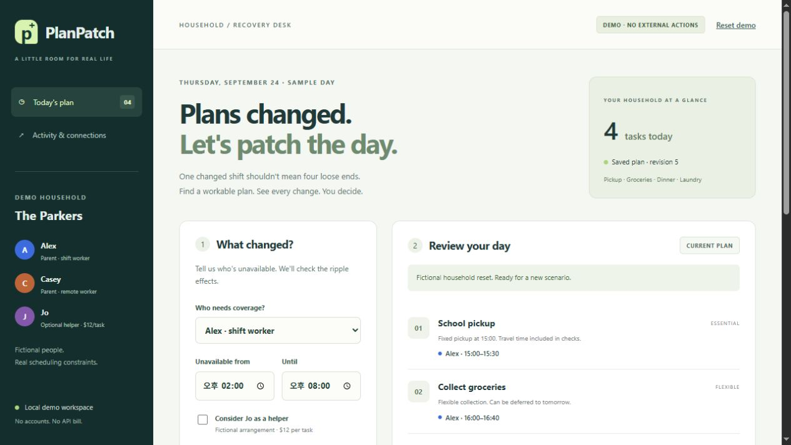

# PlanPatch

Replan a household's day when someone's work shift changes.

Alex has to stay late at work. Someone still needs to pick up the kids, collect groceries and make dinner. PlanPatch works out who can cover each task, accounts for travel time, and shows what has to move or wait until tomorrow.



This is a small prototype for the Alexa+ track of the Amazon Developer Hackathon. It has a local web app and an MCP server; it hasn't been connected to Alexa+ yet.

## Run it

You'll need Node.js 22+ and npm. No API key is needed.

```sh
npm ci
npm start
```

Open [localhost:4178](http://127.0.0.1:4178).

The demo uses a fictional family and four tasks. Try leaving Alex unavailable from 14:00 to 20:00 with no helper budget. Compare the suggested plans, review the changes, then apply one. The saved schedule survives a refresh; **Undo last applied plan** restores it.

Change the end time to 23:00 to see which optional task gets deferred. Allow Jo as a helper with a $12 budget to compare another option. That price is sample data, and applying a plan only updates local data.

## MCP

With the server running, open another terminal:

```sh
npm run demo:mcp
```

The script connects through the MCP SDK, reads the household and requests a recovery plan. Use **Review assistant proposal** in the web app to open it.

The endpoint is `http://127.0.0.1:4178/mcp`, using Streamable HTTP with MCP 2025-11-25. For clients that accept this configuration:

```json
{
  "mcpServers": {
    "planpatch": { "url": "http://127.0.0.1:4178/mcp" }
  }
}
```

| Tool | What it does |
| --- | --- |
| `get_household` | Reads tasks, availability and the saved schedule |
| `preview_recovery` | Computes alternatives without changing assignments |
| `get_recovery_plan` | Retrieves a saved proposal |

Applying a plan is handled in the web app after review. Proposals expire after 30 minutes, and an old proposal can't overwrite a newer schedule.

## How it works

The planner searches the sample day's time slots and possible assignees. It checks availability, travel time, workload, fixed appointments and the helper budget. Plans are ranked by deferrals, cost, reassignment and time changes. If an essential task can't be covered, it reports that rather than dropping the task.

- `src/planner.js` — scheduling and scoring
- `src/store.js` — JSON storage, revisions and undo
- `src/server.js` — MCP tools and web routes
- `public/` — plain HTML, CSS and JavaScript

State is stored in `.data/`, which is ignored by Git.

## Tests

```sh
npm test
```

Tests cover scheduling constraints, impossible plans, helper permissions, persistence, expired or stale proposals, undo, and MCP calls over HTTP. Browser checks are recorded in [docs/validation.md](docs/validation.md).

## Current limits

The planner handles one sample day, not overnight or multi-day schedules. Travel times and workload limits are fixed examples. There are no calendar, messaging, payment or booking connections.

The server is for local use and binds to `127.0.0.1`. Cloud clients can't reach that address, and the app doesn't have multi-user authentication, so don't expose it publicly as-is.

## Dependencies

Uses the MCP TypeScript SDK, Express and Zod.

[MIT license](LICENSE).
